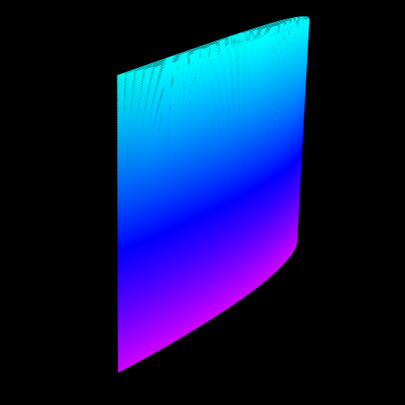
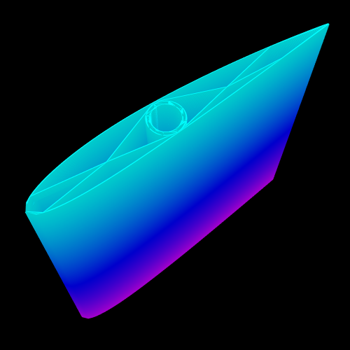
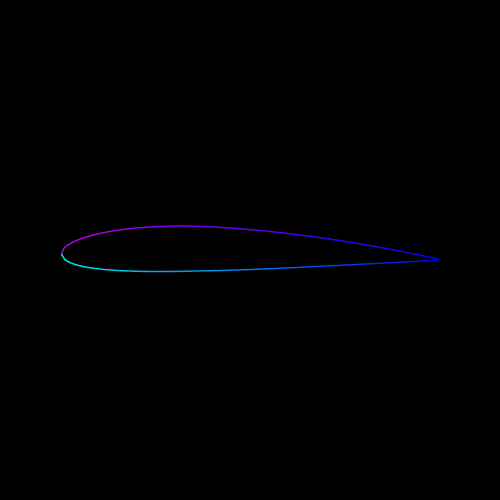

# Fullcontrol-Airfoil

# Overview

Fullcontrol airfoil is a Python script designed to generate 3D printed wings. It's a tool for hobbyists and makers to create custom gcode using [fullcontrol](https://github.com/FullControlXYZ/fullcontrol) for generating wings.

# Installation and Getting Started
#### Downloading the repository
If you have git installed you can do
>git clone https://github.com/aapolipponen/fullcontrol-airfoil

to clone the repository to your computer.

If you don't have git installed in the terminal you can download the code from the main page of this project.

#### Python

This project uses the latest version of python. Make sure to install it. The code can still run on older versions, but there is a limit to it, so your python version should be at least somewhat up-to date

#### Installing the depencies:

Dependencies:
numpy and [fullcontrol](https://github.com/FullControlXYZ/fullcontrol)

To install the depencies, run the commands:

>pip install numpy

>pip install git+https://github.com/FullControlXYZ/fullcontrol

Run the code after installing the dependencies, using the command:
> python3 src/main.py

or

> python src/main.py

To modify the parameters of the airfoil, edit the `main.py` file.

## Usage Examples

### The default airfoil:

Parameters: Default

The wing has an circle that can be used to place an carbon fiber rod. The wing also uses density 6 infill, and NACA 2412 airfoils.

## Todo

- [x] Better documentation
- [ ] Add example wings to the documentation.
- [ ] Mesh generation. Fullcontrol is implementing that so it could be possibly just integrated into this.
- [ ] Ellipses as an option for the generation of curved wings. [Example of an ellipse wing](documentation/Ellipse_wing.png)
- [ ] More example wings to the documentation. [Issue #11](https://github.com/aapolipponen/fullcontrol-airfoil/issues/11)
- [x] [Issue #1](https://github.com/aapolipponen/fullcontrol-airfoil/issues/1) and [Issue #3](https://github.com/aapolipponen/fullcontrol-airfoil/issues/3): Wing spars and ribs
- [x] [Issue #1](https://github.com/aapolipponen/fullcontrol-airfoil/issues/1): Infill
- [x] Creating elliptical wings
- [ ] Vase mode implementation. This one is kind of hard to do completely and not probably even worth it. It should be used more as an guideline. For example trying to minimize the travel moves and so on.
- [ ] A feature to create shapes that remove / add to the wing. For example, to make a cutout for a control surface.
- [ ] Issue #9: More infill options. Maybe hexagonal, rectilinear, or gyroid?
- [ ] [Add more airfoil generation options?](https://en.m.wikipedia.org/wiki/NACA_airfoil) Maybe 5-digit NACA airfoils?
- [ ] GUI? Maybe a too big of a task.

## Known Limitations

Here are some bugs and possible enhancements that don't have issues or aren't in the todo list.

1. The script execution may be slow if there are many layers. This has improved, but it's still possible for the wing to take about 20 seconds to generate. If that's the case, you probably shouldn't print it because the height of it is too big to print in one go in a reasonable time and can easily fail. Also, if the wing generates for over 30 seconds and the z_height is realistic to print, there either is a bug in the code (more likely) or the multiplier for the interpolation of imported airfoil points is too high (<5) or the `num_points` variable for generating NACA airfoils is too high (<256).

2. `move_leading_edge` and `move_trailing_edge` variables don't work if `file_extraction` is enabled.

3. Curved wings are curved from all edges that are set as movable. You can't adjust, for example, the leading edge to be straight and the trailing edge to be curved.

4. Related to 3. A curved wing's curvature amount can only be changed for both of the curves.

## Parameters

### Airfoil Parameters

`naca_nums`: NACA airfoil numbers for the 4-Digit NACA-airfoil method for generating airfoils. **Default:** `['2412', '2412']`.

`num_points`: Resolution of the NACA airfoil. Higher values give better quality but slower performance and larger file size for gcode. **Default:** `128`

More than 256 is excessive, and smaller than 70~ doesn't give the same aerodynamics that the airfoil does. It's possible to go down to about 12 for previewing the airfoils, but at numbers like that, the wing shouldn't be printed if you want good aerodynamics.

### Wing Parameters

`z_positions`: (mm) Z-heights for each airfoil. **Default:** `[0, 100]`.

`chord_lengths`: (mm except the extracted airfoils may have a different scale) Chord length for each airfoil section. **Default:** `[100, 75]`.

### File Extraction Parameters

`file_extraction`: Enable to use file extraction, disable for NACA airfoil generation method. **Default:** `False`.

**To add custom airfoils, find the profiles folder and add a file in it. Recommended websites to download airfoils are: [airfoiltools.com](http://airfoiltools.com/) and [m-selig.ae.illinois.edu](https://m-selig.ae.illinois.edu/ads.html). Then put the filename of the airfoil into the `filenames` section, and you are done.**

**It is recommended that you don't put two different filenames into the `filenames section`. If the airfoils are, for example, reversed in the direction of the points, the wing will come out improperly. For this, there is a tool.**

`filenames`: Filenames for file extraction method. These have to be in the profiles folder. **Default:** `['naca2412.dat', 'naca2412.dat']`.

- **interpolate**: Enable/disable interpolation for the imported airfoil. Interpolation in this context means increasing the number of points that define the airfoil shape. If set to `True`, the software will multiply the number of points by the value set in the `interpolate_airfoil_multiplier` parameter.

- **interpolate_airfoil_multiplier**: This parameter is used as a multiplier for the number of points defining the airfoil when `interpolate` is set to `True`. For example, if you have 50 points defining your airfoil, and you set `interpolate_airfoil_multiplier` to 2, the software will generate an airfoil with 100 points.

- **sort_point_order**: When enabled, will sort the points of the airfoil to start and end at `min_X` or `x=0` depending on if you have `move_leading_edge` enabled or not. This is typically used to ensure that the software is working with a well-ordered set of points for constructing the airfoil.

- **reverse_points_sorting**: Will reverse the direction that the `sort_point_order` parameter sorts the points to start and end at. If enabled, it makes the points start and end at `max_x` or `x=chord_length`. This is used if an imported airfoil is reversed and starts at the trailing edge instead of the leading edge.

### Infill Parameters

`generate_infill`: Enable to generate infill. This enhances the structure of the wing and is needed if you don't do anything else to reinforce it. Not needed if you, for example, use your wing as a fiberglass mold. **Default:** `True`.

`infill_density`: Density of infill. Higher values result in denser infill, which makes the wing stronger but also weigh more. **Default:** `6`.

**NOTE: When 3D printing wings, the weight of the wing is crucial, so the infill density shouldn't be raised above 8 if using the default `modified_triangle_wave_infill`.**

`infill_reverse`: Enable to reverse infill direction. **Default:** `False`.

`infill_rise`: Enable to raise infill by half layer height when returning to the start point of infill. **Default:** `False`.

`infill_type`: Infill pattern type. Only option is `modified_triangle_wave_infill`. It's encouraged to play with the source code of the program and make additions. If you make a bug fix or have anything to add to the script, make an issue or a pull request!

### Fully Filled Layer

`filled_layers_enabled`: Enable to generate a fully filled layer. Used sometimes, for example, to make end caps for wings or on the first few layers to have better adhesion to the bed. **Default:** `True`.

`fill_angle`: (degrees) Angle that the lines for the fill should go in. **Default:** `45`.

**NOTE: The default `fill_angle` probably isn't the best possible angle, and the angle probably varies depending on the infill and other options. It hasn't been tested which angle is the best. Take the default number with a grain of salt.**

`filled_layers`: (list of layer heights in mm) Layers that should be fully filled. If the number is not a valid layer, the number is rounded to the closest valid layer height. **Default:** `[0, 0.3, 0.6]`.

### Circle Generation Parameters

`generate_circle`: Enable to generate a circle at the coordinates defined in `circle_centers`. **Default:** `False`.

`circle_centers`: List of coordinates specifying the center points for the start and end of the circle. **Default:** `[{"start_center": fc.Point(x=40.8, y=1.35, z=min(z_positions)), "end_center": fc.Point(x=40.8, y=1.35, z=max(z_positions))}]`.

`circle_radius`: (mm) Radius of the circle. **Default:** `4`.

`circle_num_points`: Number of points in the circle. Works the same as the num_points for airfoils. **Default:** `24`.

`circle_offset`: Offset for the second circle. **Default:** `0.75`.

`circle_segment_angle`: (degrees) Angle covered by each pass when drawing the circle. **Default:** `45`.

`circle_start_angle`: (degrees) Starting angle for the circle. **Default:** `180`.

**NOTE: Right now, the circle is drawn in segments. Between the segments is a sawtooth shape that improves the structure of the circle. A toggle should be added to remove this and only generate one circle.**

**NOTE: Use, for example, carbon fiber rods to reinforce the wing by placing a circle with the radius of the rod at coordinates that you want it to be placed at. When the wing has printed, place the rod into the circle and glue the ends. This improves the structural integrity of the wing a lot without adding much weight.**

### Wing Curvature Settings

`move_leading_edge`: Enable to allow movement of the leading edge. **Default:** `True`.

`move_trailing_edge`: Enable to allow movement of the trailing edge. **Default:** `True`. **Note: These don't work with `file_extraction` enabled. That is on the radar for bugs.**

`curved_wing`: Enable to make the wing curved. Right now, the only method for curving is quadratic interpolation, but that may change soon. Other methods to curve the wing like elliptical are coming soon. **Default:** `False`.

`curve_amount`: Amount of curvature to apply to the wing. **Default:** `1`.

### Layer Height and Width Settings

`layer_height`: (mm) Height of each layer. **Default:** `0.3`.

`line_width`: (mm) Width of each line. **Default:** `0.4`.

### Offset Parameters

`offset_wing`: Enable to offset the wing. **Default:** `False`.

`offset_x`: (mm) Offset in the x-axis. **Default:** `50`.

`offset_y`: (mm) Offset in the y-axis. **Default:** `100`.

`offset_z`: (mm) Offset in the z-axis. **Default:** `0`.

**NOTE: Use `offset_z` to offset the z height if the nozzle drags the bed of your 3D printer. The z offset of the 3D printer may not work when using fullcontrol. This has been seen at least in Klipper.**

### Pre-Print Settings

`calibration_moves`: Enable to perform extra travel move at the start. **Default:** `False`.

`bed_x_max`: (mm) Maximum x-coordinate of the bed. **Default:** `300`.

`bed_y_max`: (mm) Maximum y-coordinate of the bed. **Default:** `300`.

### Post-Print Settings

`z_hop_enabled`: Enable to move z up by a set amount after the print is done. **Default:** `False`.

`z_hop_amount`: (mm) Height to move the extruder up after printing. **Default:** `50`.

### 3D Printing Configuration

`gcode_generation`: Enable G-code generation. **Default:** `False`.

`gcode_name`: Output filename for G-code. **Default:** `'gcode_output'`.

### Printer Specific Settings

`printer_settings`: Various printer specific settings. If you own a 3D printer, these probably don't need explanations. **Default:** `{ "extrusion_width": 0.4, "extrusion_height": 0.3, "print_speed": 2000, "travel_speed": 2000, "nozzle_temp": 210, "bed_temp": 60 }`.

**NOTE: THESE WORK FOR ME BUT MAY NOT WORK FOR YOU! All of these settings are pretty printer-specific. If you want to 3D print the wing you have generated, make sure to double-check these settings.**

**NOTE: The print_speed and travel_speed are maximum acceleration values, not maximum speeds. Make sure to set your maximum speeds in your firmware to something realistic, the maximum speeds are something like 120mm/s, not √(2000m/s).**

### Debug Setting

`print_total_layers`: Print the total number of layers. **Default:** `True`.

`print_rendering_plot`: Print a message when the rendering plot. **Default:** `True`.

`print_generating_gcode`: Print if the G-code generation is enabled or not. **Default:** `True`.

`print_time_taken`: Print the time taken for the generation of the wing. **Default:** `True`.

`print_generation_done`: Print a message when generation is done. **Default:** `True`.

## Some Terminology

**Airfoil**: The shape of a wing. For example, if you look at a cut section of an aircraft wing, you see an airfoil. Eg. NACA 2412 

**NACA Airfoil**: A series of airfoil shapes developed by the National Advisory Committee for Aeronautics (NACA), the predecessor to NASA. The shapes are described using a series of digits following the word "NACA." This program uses the 4-Digit NACA airfoil system. The NACA airfoils can be calculated using a series of formulas.

**Chord** / **Chord length**: The straight-line distance from the leading edge to the trailing edge of an airfoil.

**Leading Edge**: The front of the airfoil and the part that contacts the wind first.

**Trailing Edge**: The rear of an airfoil.

**Elliptical Wing**: A type of wing design used, for example, in the Spitfire.

**Spar**: A structural element that is basically just a fully filled section of an airfoil. These are commonly used in RC planes made out of balsa and some real aircraft.

**Rib**: A structural element that goes lengthwise through a wing and strengthens it. In RC planes, these are usually something like carbon fiber rods or balsa, depending on the type of craft.

## Contributions

Contributions to Fullcontrol-Airfoil are welcome and encouraged! If you have an enhancement or a bug fix, feel free to make a pull request.

## License

Fullcontrol-Airfoil is released under the [GNU General Public License v3.0](https://www.gnu.org/licenses/gpl-3.0.en.html).
